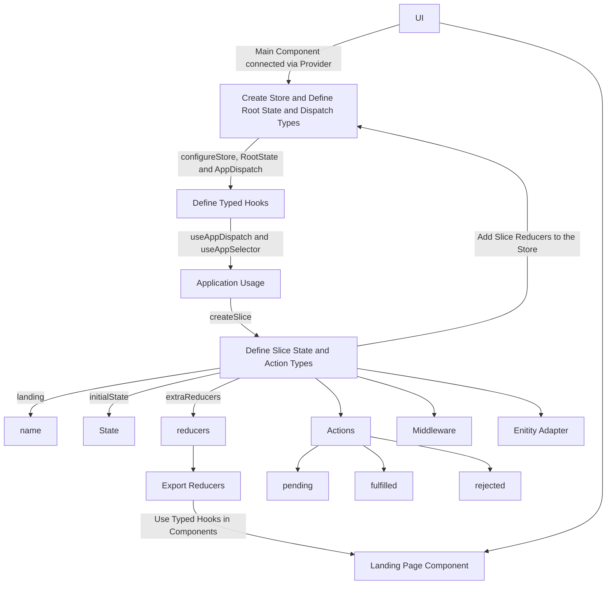

# React Redux Typescript Boilerplate

Skeleton for React & Redux Apps written in TypeScript (with integrated SASS, ESLint, Prettier, and Husky)

This project was bootstrapped with [Create React App](https://github.com/facebook/create-react-app), using the [Redux](https://redux.js.org/) and [Redux Toolkit](https://redux-toolkit.js.org/) template.

### Purpose

Our main purpose with this Skeleton is to start frontend application with react with redux toolkit and typescript.

Try it!! I am happy to hear your feedback or any kind of new features.

### Common Features

- Quick start
- Integrated eslint, prettier and husky
- Integrated Redux Toolkit
- Integrated sass
- Based on Typescript Syntax
- Production Ready Skeleton

### Start the application

- Clone the Application git clone `https://github.com/santoshshinde2012/react-redux-typescript-boilerplate.git`
- Install the dependencies `npm install`
- Start the application `npm run dev`

### Running the build

All the different build steps are orchestrated via [npm scripts](https://docs.npmjs.com/misc/scripts).
Npm scripts basically allow us to call (and chain) terminal commands via npm.
This is nice because most JavaScript tools have easy to use command line utilities allowing us to not need grunt or gulp to manage our builds.
If you open `package.json`, you will see a `scripts` section with all the different scripts you can call.
To call a script, simply run `npm run <script-name>` from the command line.
You'll notice that npm scripts can call each other which makes it easy to compose complex builds out of simple individual build scripts.
Below is a list of all the scripts this template has available:

| Npm Script | Description  |
| ------------------------- | ------------------------------------------------------------------------------------------------- |
| `build`                   | Full build. Runs ALL build tasks |
| `build:prod`                   | Full production build. Runs ALL build tasks |
| `start:dev`                   | Run the application in dev mode                                       |
| `build:css`                   | Build the css for production environment                                         |
| `lint`                    | Runs ESLint on project files                                                                      |
| `lint:fix`                    | Runs ESLint on project files and fixed the auto fix issues                                                                     |
| `format`             | Runs the file formatter                                                              |
| `test`                    | Runs tests using Jest test runner                                                                 |
| `test:coverage`              | Runs tests to check code coverage                                                                          |

### Project Structure

| Name | Description |
| ------------------------ | --------------------------------------------------------------------------------------------- |
| **wiki/**                         | You can add project documentation and insructions file here |
| **src**                  | Contains your source code that will be compiled to the build dir                               |
| **src/components/**                | UI Components  |
| **src/pages/**                       | We can also call this "features" if we break the pages based on what will be served in the browser|
| **src/resources/**               | Constant Variables such as images and strings  |
| **src/routes/**               | Routing Configuration|
| **src/store/**               |  Contains slice and hooks |
| **src/store/${page-name}/slice.ts               |  Contains slice configuration {state, action and reducers} |
| **src/store/index.ts               |  Entry point for store configuration|
| **src/styles/**               | SASS styles |
| **src/types/**               | Schema or Types |
| **src/utils/**               | Reusable utlity like api http client |
| **src**/index.ts        | Entry point to your frontend app                                                               |
| package.json             | File that contains npm dependencies
| tsconfig.json            | Config settings for compiling server code written in TypeScript                               |
| .eslintrc.json                | Config settings for ESLint code style checking                                                |
| .eslintignore            | Config settings for paths to exclude from linting                                             |
| prettierrc.json                | Config settings for Prettier code format checking                                                |
| .prettierignore            | Config settings for paths to exclude from formatting                                             |
| **.vscode**              | Contains VS Code specific settings                                                            |
| **.github**              | Contains GitHub settings and configurations, including the GitHub Actions workflows            |
| **.husky**              | Contains Husky settings and configurations            |
| **build**                 | Contains the distributable (or output) from your TypeScript build. This is the code you ship  |
| **node_modules**         | Contains all your npm dependencies                                                            |

### Documentations

Below is the basic flow for setting up the store and slice and using them in components. The official documentation can be found [here](https://redux-toolkit.js.org/tutorials/typescript) if you would like more information.

