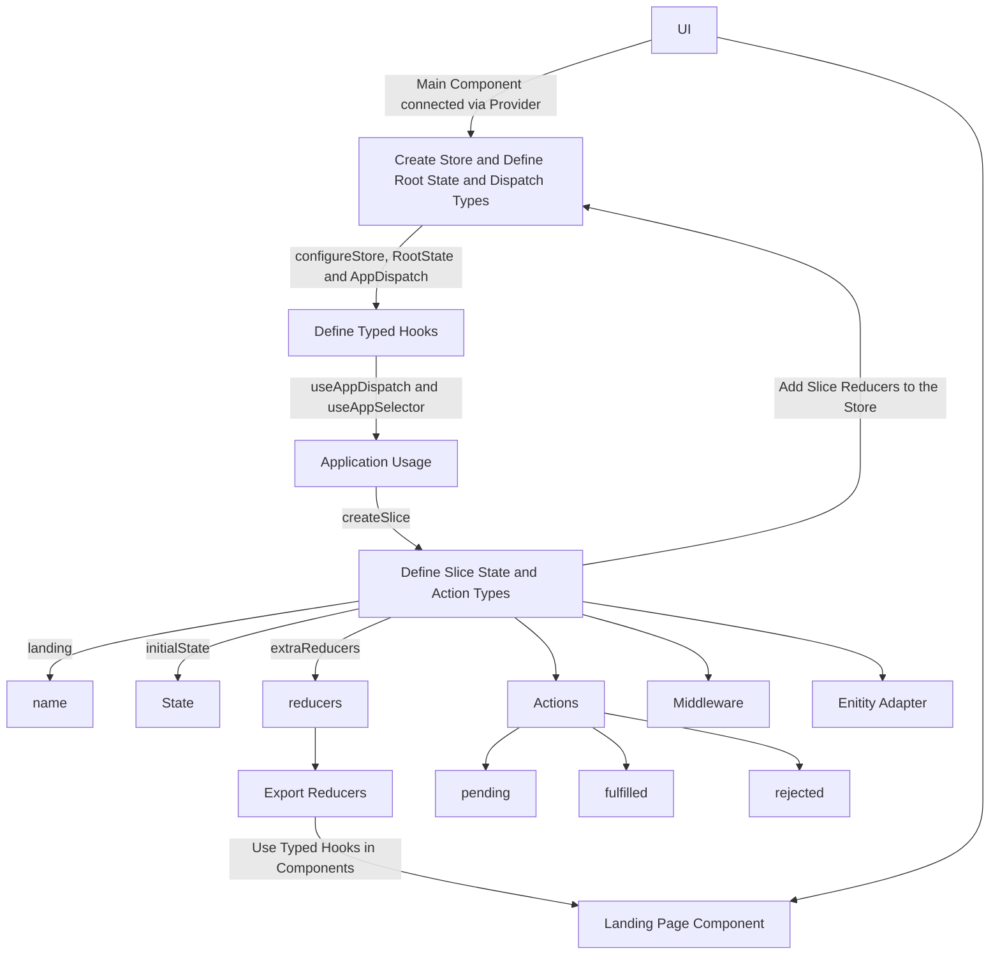

# React Redux Typescript Boilerplate [](https://sonarcloud.io/summary/new_code?id=NeoSOFT-Technologies_frontend-reactjs)[](https://github.com/NeoSOFT-Technologies/frontend-reactjs/actions/workflows/ci.yml)


Skeleton for React & Redux Apps written in TypeScript (with integrated SASS, ESLint, Prettier, and Husky)

This project was bootstrapped with [Create React App](https://github.com/facebook/create-react-app), using the [Redux](https://redux.js.org/) and [Redux Toolkit](https://redux-toolkit.js.org/) template.


## Overview
 - Frontend-reactjs is an typescript boilerplate which is basically a set of web pages, built with HTML, CSS, and Javascript or any javascript libraries (in our case ReactJS in conjunction with typescript) used to create a quick start boilerplate web application. In this we using SEO stratergy to improve the visibility of the website,Implemented Localization,with auth-guard we have provided authentication,Integrated redux-toolkit,and quick start 

- ReactJS improves performance due to virtual DOM. The DOM is a cross-platform and programming API which deals with HTML, XML or XHTML. Most of the developers faced the problem when the DOM was updated, which slowed down the performance of the application. ReactJS solved this problem by introducing virtual DOM.

- ReactJS is choosen by most of the web developers. It is because it offers a very rich JavaScript library. The JavaScript library provides more flexibility to the web developers to choose the approch they want to follow.

Take it for a test drive. We'd love to hear any feedback you have or if you've thought of a new feature.

## Motivation

- With this boilerplate, you can easily  quick start a react boilerplate using Reactjs.
- Rather than spending time on the project setup, get on with the important stuff right away. 

## Table of Contents

- [Features](#features)
- [Getting started](#getting-started)
- [Project Structure](#project-structure)
- [Documentation](#documentations)
- [Miscellaneous](#miscellaneous)
- [Trainings](#trainings)
- [Video Tutorials](#video-tutorials)
- [Contributing To This Project](#contributing-to-this-project)
- [Stay in touch](#stay-in-touch)

## Features

- **Quick start**
- **Integrated ESLint, Prettier and Husky**
- **Production-Ready Skeleton**
- **Common Error Handler**
- **Auth Guard**
- **Localization**
- **SEO stratergy**
- **Next generation Sass**
- **Form Validation Using Regex**
- **Testing**: unit and integration tests using [Jest](https://jestjs.io)
- **Environment variables**: segregated env files for easier variable management.
- **CI**: Continuous integration
- **Docker support**
- **Git hooks**: with [husky](https://github.com/typicode/husky) 
- **Linting**: with [ESLint](https://eslint.org) and [Prettier](https://prettier.io)

## Getting started

Makes easier to write good redux applications and speeds up development.

- Node <https://nodejs.org/en/> *use the LTS version*
- NPM

### Create Development Environment

  Use template strings, object destructuring, arrow functions, Interfaces, JSX syntax and more.

- [Learn more about TypeScript](https://github.com/NeoSOFT-Technologies/frontend-reactjs/blob/main/wiki/features/typescript.md)

```bash
// clone the application
$ git clone https://github.com/NeoSOFT-Technologies/frontend-reactjs
```
#### Install The Dependencies

- [Learn more about Sass](https://github.com/NeoSOFT-Technologies/frontend-reactjs/blob/main/wiki/features/sass.md)

```bash
// Install the required npm modules
$ npm install
```

#### Create The Environment Variables

The `env` file should be placed in root folder with the following variables.

- `.env` : Default Environment File
- `.env.test` : Test Environment File
- `.env.production` : Production Environment File
- `.env.staging` : Staging Environment File


```
# .env example

PORT= <port_no_for_application>
REACT_APP_API_BASEURL=<backend_api_base_url>
REACT_APP_CDN_URL=/global
REACT_APP_IMAGES_CDN_URL=<baseurl_where_images_is_situated>
REACT_APP_HOST=<frontend_api_base_url>
```


#### Running the app

```bash
# development
$ npm run start

# production mode
$ npm run start:prod
```

#### Test

For this project, We chose [Jest](https://facebook.github.io/jest/) as our test framework.


```bash
# unit tests
$ npm run test

# test coverage
$ npm run test:coverage
```


#### Running the build

All the different build steps are orchestrated via [npm scripts](https://docs.npmjs.com/misc/scripts).
Npm scripts basically allow us to call (and chain) terminal commands via npm.
This is nice because most JavaScript tools have easy to use command line utilities allowing us to not need grunt or gulp to manage our builds.
If you open `package.json`, you will see a `scripts` section with all the different scripts you can call.
To call a script, simply run `npm run <script-name>` from the command line.
You'll notice that npm scripts can call each other which makes it easy to compose complex builds out of simple individual build scripts.
Below is a list of all the scripts this template has available:

| Npm Script      | Description                                                       |
| --------------- | ----------------------------------------------------------------- |
| `start`         | Start project in development mode                                 |
| `start:prod`    | this script runs project in production mode                       |
| `build`         | Full build. Runs ALL build tasks                                  |
| `clean`         | On Run clean the installed node packages                          |
| `clean:cdn`     | On Run clean css from build                                       |
| `build:prod`    | Runs build and build:css together                                 |
| `test`          | Runs tests using Jest test runner                                 |
| `eject`         | Runs react-scripts eject                                          |
| `format`        | Runs prettier roles on project files                              |
| `test:coverage` | Gives the code coverage infrom to table                           |
| `lint`          | Runs ESLint on project files                                      |
| `lint:fix`      | Runs lint and fix the resolve able errors                         |
| `lint:quiet`    | Run lint to show errors only                                      |
| `prepare`       | install husky                                                     |
| `precommit`     | Runs lint:fix and format before commit                            |
| `prepush`       | Runs lint before push                                             |

## NPM Modules

Node Modules folder is the repository of modules/library which you are using inside your project. What ever you are importing in your project that module or library should present inside the mode_module folder.When you do npm install that time that module or the library install inside the node_module folder and one entry added in package.json file. In your case frontend and backend are different project than obviously there will be 2 different node_modules folder for each of them.
To check the list of modules used by us in this boilerplate click [here](https://github.com/NeoSOFT-Technologies/frontend-reactjs/blob/main/wiki/npm_modules/index.md)


## Project Structure

| Name | Description |
| ------------------------ | --------------------------------------------------------------------------------------------- |
| **wiki/**                         | You can add project documentation and insructions file here |
| **src**                  | Contains your source code that will be compiled to the build dir                               |
| **src/components/**                | UI Components  |
| **src/pages/**                       | We can also call this "features" if we break the pages based on what will be served in the browser|
| **src/resources/**               | Constant Variables such as images and strings  |
| **src/routes/**               | Routing Configuration|
| **src/store/**               |  Contains slice and hooks |
| **src/store**/${page-name}/slice.ts               |  Contains slice configuration {state, action and reducers} |
| **src/store**/index.ts               |  Entry point for store configuration|
| **src/styles/**               | SASS styles |
| **src/types/**               | Schema or Types |
| **src/utils/**               | Reusable utlity like api http client |
| **src**/index.ts        | Entry point to your frontend app                                                               |
| package.json             | File that contains npm dependencies
| tsconfig.json            | Config settings for compiling server code written in TypeScript                               |
| .eslintrc.json                | Config settings for ESLint code style checking                                                |
| .eslintignore            | Config settings for paths to exclude from linting                                             |
| prettierrc.json                | Config settings for Prettier code format checking                                                |
| .prettierignore            | Config settings for paths to exclude from formatting                                             |
| **.vscode**              | Contains VS Code specific settings                                                            |
| **.github**              | Contains GitHub settings and configurations, including the GitHub Actions workflows            |
| **.husky**              | Contains Husky settings and configurations            |
| **build**                 | Contains the distributable (or output) from your TypeScript build. This is the code you ship  |
| **node_modules**         | Contains all your npm 
dependencies                                                            |     


## Documentations

### Project flow
<br/>


Below is the basic flow for setting up the store and slice and using them in components. The official documentation can be found [here](https://redux-toolkit.js.org/tutorials/typescript) if you would like more information.


## Modules

- [Eslint](https://github.com/NeoSOFT-Technologies/frontend-reactjs/blob/main/wiki/npm_modules/eslint.md)
- [Axios](https://github.com/NeoSOFT-Technologies/frontend-reactjs/blob/main/wiki/npm_modules/axios.md)
- [Env](https://github.com/NeoSOFT-Technologies/frontend-reactjs/blob/main/wiki/features/env.md)
- [Husky](https://github.com/NeoSOFT-Technologies/frontend-reactjs/blob/main/wiki/npm_modules/husky.md)
- [i18next](https://github.com/NeoSOFT-Technologies/frontend-reactjs/blob/main/wiki/npm_modules/i18next.md)
- [Prettier](https://github.com/NeoSOFT-Technologies/frontend-reactjs/blob/main/wiki/npm_modules/prettier.md)
- [React-Dom](https://github.com/NeoSOFT-Technologies/frontend-reactjs/blob/main/wiki/npm_modules/react-dom.md)
- [React-router-dom](https://github.com/NeoSOFT-Technologies/frontend-reactjs/blob/main/wiki/npm_modules/react-router-dom.md)
- [React-redux](https://github.com/NeoSOFT-Technologies/frontend-reactjs/blob/main/wiki/npm_modules/react-redux.md)
- [React-script](https://github.com/NeoSOFT-Technologies/frontend-reactjs/blob/main/wiki/npm_modules/react-scripts.md)
- [React-toastify](https://github.com/NeoSOFT-Technologies/frontend-reactjs/blob/main/wiki/npm_modules/react-toastify.md)
- [Redux-mock-store](https://github.com/NeoSOFT-Technologies/frontend-reactjs/blob/main/wiki/npm_modules/redux-mock-store.md)
- [Redux-toolkit](https://github.com/NeoSOFT-Technologies/frontend-reactjs/blob/main/wiki/npm_modules/redux-toolkit.md)
- [Testing](https://github.com/NeoSOFT-Technologies/frontend-reactjs/blob/main/wiki/testing/testing.md)
- [Tyescript](https://github.com/NeoSOFT-Technologies/frontend-reactjs/blob/main/wiki/features/typescript.md)
- [react-helmet](https://github.com/NeoSOFT-Technologies/frontend-reactjs/blob/main/wiki/npm_modules/react-helmet.md)


## Miscellaneous

- [Known Issues](https://github.com/NeoSOFT-Technologies/frontend-reactjs/blob/main/wiki/miscellaneous/known-issues.md)
- [Git commits](https://github.com/NeoSOFT-Technologies/frontend-reactjs/blob/main/wiki/miscellaneous/git-commits.md)
- [Installation Pretteri, Husky & Lint](https://github.com/NeoSOFT-Technologies/frontend-reactjs/blob/main/wiki/miscellaneous/installation-pretteri-husky-lint.md)

## trainings 
- [Concepts](https://github.com/NeoSOFT-Technologies/frontend-reactjs/blob/main/wiki/setup/concepts.md)
- [Getting started /Installation](https://github.com/NeoSOFT-Technologies/frontend-reactjs/blob/main/wiki/training/getting_started.md)
- [How to create components](https://github.com/NeoSOFT-Technologies/frontend-reactjs/blob/main/wiki/training/create_component.md)
- [Redux Toolkit Flow of implementation](https://github.com/NeoSOFT-Technologies/frontend-reactjs/blob/main/wiki/training/redux-toolkit.md)
- [Unit Test cases and its implementation(jest)](https://github.com/NeoSOFT-Technologies/frontend-reactjs/blob/main/wiki/training/unit_test_cases_jest.md)
- [Unit Test cases and its implementation(axios-mock-adaptor)](https://github.com/NeoSOFT-Technologies/frontend-reactjs/blob/main/wiki/training/axios_mock_adapter_slice.md)
- [API Factory]()
- [i18next implementation](https://github.com/NeoSOFT-Technologies/frontend-reactjs/blob/main/wiki/npm_modules/i18next.md)
- [Auth Guard Strategy](https://github.com/NeoSOFT-Technologies/frontend-reactjs/blob/main/wiki/training/authguard.md)
- [SEO Strategy](https://github.com/NeoSOFT-Technologies/frontend-reactjs/blob/main/wiki/training/seo.md)


## Video Tutorials
- [Project walkthrough](https://drive.google.com/file/d/1JPa1hknt9O615FB206VAlEhDLgI_v5Fi/view?usp=sharing)
- [Auth Guard Strategy](https://www.loom.com/share/6521f92ac17147e6b36272a9cc3aaa83)
- [SEO Strategy](https://www.loom.com/share/edb1d901eadd456ea854cc2f7614f0a6)
- [How to create a component](https://www.loom.com/share/8087eb4a39a94b43805c8378e98ec64c)
- [Jest Testing](https://www.loom.com/share/95b9afd7cd82457b88f05039736e9f23)
- [Axios mock adapter](https://www.loom.com/share/cdd62859b89548d7b9a494d97badf89a)
- [Redux toolkit](https://youtube.com/playlist?list=PLM0LBHjz37LXSASzEv81f3tGptAsEGQUM)

## Contributing To This Project

Contributions are welcome from anyone and everyone. We encourage you to review the [guiding principles for contributing](https://github.com/NeoSOFT-Technologies/rest-node-nestjs/blob/main/wiki/docs/contribution.md)

* [Bug reports](https://github.com/NeoSOFT-Technologies/frontend-reactjs/blob/main/wiki/contribution/bug-reports.md)
* [Feature requests](https://github.com/NeoSOFT-Technologies/frontend-reactjs/blob/main/wiki/contribution/feature-requests.md)
* [Pull requests](https://github.com/NeoSOFT-Technologies/frontend-reactjs/blob/main/wiki/contribution/pull-requests.md)

## Stay in touch

* Website - [https://www.neosofttech.com/](https://www.neosofttech.com/)
* Twitter - [@neosofttech](https://twitter.com/neosofttech)
* Meetup -  [https://www.meetup.com/neosoft-technologies/](https://www.meetup.com/neosoft-technologies/)
* Medium -  [https://medium.com/@neosofttech-technologies-blog](https://medium.com/@neosofttech-technologies-blog)
* GitHub - [https://github.com/NeoSOFT-Technologies](https://github.com/NeoSOFT-Technologies)
* Discord - [ReactJS](https://discord.gg/9xW5gQhQa4)
