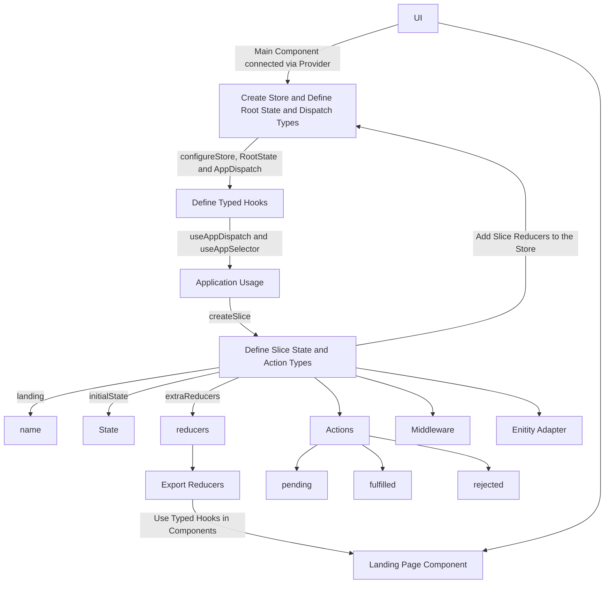

# React Redux Typescript Boilerplate [](https://sonarcloud.io/summary/new_code?id=NeoSOFT-Technologies_frontend-reactjs)[](https://github.com/NeoSOFT-Technologies/frontend-reactjs/actions/workflows/ci.yml)


Skeleton for React & Redux Apps written in TypeScript (with integrated SASS, ESLint, Prettier, and Husky)

This project was bootstrapped with [Create React App](https://github.com/facebook/create-react-app), using the [Redux](https://redux.js.org/) and [Redux Toolkit](https://redux-toolkit.js.org/) template.

## Exciting Features


  ### Quick start
  Create components, containers, routes, selectors and sagas - and their tests - right from the CLI!
  
  ### Integrated eslint, prettier and husky
   Integrated ESLint, Prettier and Husky helps to take care of your code style, code formatting respectively and is a tool that allows us to easily wrangle Git hooks and run the scripts we want at those stages respectively. 

  - [Learn more about Eslint](https://github.com/NeoSOFT-Technologies/frontend-reactjs/blob/main/wiki/modules/eslint.md)
  - [Learn more about Prettier](https://github.com/NeoSOFT-Technologies/frontend-reactjs/blob/main/wiki/modules/prettier.md)
  - [Learn more about Husky](https://github.com/NeoSOFT-Technologies/frontend-reactjs/blob/main/wiki/modules/husky.md)
  
  
  ### Instant feedback
  Enjoy the best DX (Developer eXperience) and code your app at the speed of thought! Your saved changes to the JS are reflected instantaneously without refreshing the page. Preserve application state even when you update something in the underlying code!

### Integrated Redux Toolkit
  Makes easier to write good redux applications and speeds up development.

- [Learn more about redux-toolkit](https://github.com/NeoSOFT-Technologies/frontend-reactjs/blob/main/wiki/modules/redux-toolkit.md)
  
### Based on TypeScript
  Use template strings, object destructuring, arrow functions, Interfaces, JSX syntax and more.

  - [Learn more about TypeScript](https://github.com/NeoSOFT-Technologies/frontend-reactjs/blob/main/wiki/features/typescript.md)

### Next generation SaaS
  Variables, nested rules, inline imports, and more are all possible with Sass. It also aids organisation and allows us to develop style sheets more quickly. All versions of CSS are supported by Sass.

  - [Learn more about Sass](https://github.com/NeoSOFT-Technologies/frontend-reactjs/blob/main/wiki/features/sass.md)

### Industry-standard i18n internationalization support
  Scalable apps need to support multiple languages, easily add and support multiple languages with `react-i18next`.
  
- [Learn more about i18next](https://github.com/NeoSOFT-Technologies/frontend-reactjs/blob/main/wiki/features/i18next.md)

### Offline-first
  The next frontier in performant web apps: availability without a network connection from the instant your users load the app.

### Static code analysis
  Focus on writing new features without worrying about formatting or code quality. With the right editor setup, your code will automatically be formatted and linted as you work.
  
### Production Ready Skeleton
  The ease of usability, reliability and availability of software to the users 

### SEO startergy
  We support SEO (document head tags management) for search engines that support indexing of JavaScript content(eg. Google) with the help of ```react-helmet``` 


## Purpose

Our main purpose with this Skeleton is to start frontend application with react with redux toolkit and typescript.

Try it!! I am happy to hear your feedback or any kind of new features.

## Start the application

- Clone the Application git clone `https://github.com/NeoSOFT-Technologies/frontend-reactjs.git`
- Install the dependencies `npm install`
- Start the application `npm run dev`

## Running the build

All the different build steps are orchestrated via [npm scripts](https://docs.npmjs.com/misc/scripts).
Npm scripts basically allow us to call (and chain) terminal commands via npm.
This is nice because most JavaScript tools have easy to use command line utilities allowing us to not need grunt or gulp to manage our builds.
If you open `package.json`, you will see a `scripts` section with all the different scripts you can call.
To call a script, simply run `npm run <script-name>` from the command line.
You'll notice that npm scripts can call each other which makes it easy to compose complex builds out of simple individual build scripts.
Below is a list of all the scripts this template has available:


| Npm Script | Description  |
| ------------------------- | ------------------------------------------------------------------------------------------------- |
| `build`                   | Full build. Runs ALL build tasks |
| `build:prod`                   | Full production build. Runs ALL build tasks |
| `start:dev`                   | Run the application in dev mode                                       |
| `build:css`                   | Build the css for production environment                                         |
| `lint`                    | Runs ESLint on project files                                                                      |
| `lint:fix`                    | Runs ESLint on project files and fixed the auto fix issues                                                                     |
| `format`             | Runs the file formatter                                                              |
| `test`                    | Runs tests using Jest test runner                                                                 |
| `test:coverage`              | Runs tests to check code coverage                                                                          |


## NPM Modules 

  Node Modules folder is the repository of modules/library which you are using inside your project. What ever you are importing in your project that module or library should present inside the mode_module folder.When you do npm install that time that module or the library install inside the node_module folder and one entry added in package.json file. In your case frontend and backend are different project than obviously there will be 2 different node_modules folder for each of them.
  To check the list of modules used by us in this boilerplate click [here](https://github.com/NeoSOFT-Technologies/frontend-reactjs/blob/main/wiki/npm_modules/index.md)

## Project Structure

| Name | Description |
| ------------------------ | --------------------------------------------------------------------------------------------- |
| **wiki/**                         | You can add project documentation and insructions file here |
| **src**                  | Contains your source code that will be compiled to the build dir                               |
| **src/components/**                | UI Components  |
| **src/pages/**                       | We can also call this "features" if we break the pages based on what will be served in the browser|
| **src/resources/**               | Constant Variables such as images and strings  |
| **src/routes/**               | Routing Configuration|
| **src/store/**               |  Contains slice and hooks |
| **src/store**/${page-name}/slice.ts               |  Contains slice configuration {state, action and reducers} |
| **src/store**/index.ts               |  Entry point for store configuration|
| **src/styles/**               | SASS styles |
| **src/types/**               | Schema or Types |
| **src/utils/**               | Reusable utlity like api http client |
| **src**/index.ts        | Entry point to your frontend app                                                               |
| package.json             | File that contains npm dependencies
| tsconfig.json            | Config settings for compiling server code written in TypeScript                               |
| .eslintrc.json                | Config settings for ESLint code style checking                                                |
| .eslintignore            | Config settings for paths to exclude from linting                                             |
| prettierrc.json                | Config settings for Prettier code format checking                                                |
| .prettierignore            | Config settings for paths to exclude from formatting                                             |
| **.vscode**              | Contains VS Code specific settings                                                            |
| **.github**              | Contains GitHub settings and configurations, including the GitHub Actions workflows            |
| **.husky**              | Contains Husky settings and configurations            |
| **build**                 | Contains the distributable (or output) from your TypeScript build. This is the code you ship  |
| **node_modules**         | Contains all your npm dependencies                                                            |

## Documentations


Below is the basic flow for setting up the store and slice and using them in components. The official documentation can be found [here](https://redux-toolkit.js.org/tutorials/typescript) if you would like more information.




## Training 
- [Concepts](https://github.com/NeoSOFT-Technologies/frontend-reactjs/blob/main/wiki/setup/concepts.md)
- [Getting started /Installation](https://github.com/NeoSOFT-Technologies/frontend-reactjs/blob/main/wiki/howto/getting_started.md)
- [How to create components](https://github.com/NeoSOFT-Technologies/frontend-reactjs/blob/main/wiki/howto/create_component.md)
- [Redux Toolkit Flow of implementation](https://github.com/NeoSOFT-Technologies/frontend-reactjs/blob/main/wiki/howto/redux-toolkit.md)
- [Unit Test cases and its implementation(jest)](https://github.com/NeoSOFT-Technologies/frontend-reactjs/blob/main/wiki/howto/unit_test_cases_jest.md)
- [Unit Test cases and its implementation(axios-mock-adaptor)]()
- [API Factory]()
- [i18next implementation](https://github.com/NeoSOFT-Technologies/frontend-reactjs/blob/main/wiki/npm_modules/i18next.md)
- [Auth Guard Strategy](https://github.com/NeoSOFT-Technologies/frontend-reactjs/blob/main/wiki/howto/authguard.md)
- [SEO Strategy](https://github.com/NeoSOFT-Technologies/frontend-reactjs/blob/main/wiki/howto/seo.md)

## Video Tutorials
- [Project walkthrough](https://drive.google.com/file/d/1JPa1hknt9O615FB206VAlEhDLgI_v5Fi/view?usp=sharing)
- [Auth Guard Strategy](https://www.loom.com/share/6521f92ac17147e6b36272a9cc3aaa83)
- [SEO Strategy]()
- [How to create a component](https://www.loom.com/share/8087eb4a39a94b43805c8378e98ec64c)
- [Jest Testing](https://www.loom.com/share/95b9afd7cd82457b88f05039736e9f23)
- [Axios mock adapter](https://www.loom.com/share/cdd62859b89548d7b9a494d97badf89a)
- [Redux toolkit](https://youtube.com/playlist?list=PLM0LBHjz37LXSASzEv81f3tGptAsEGQUM)
