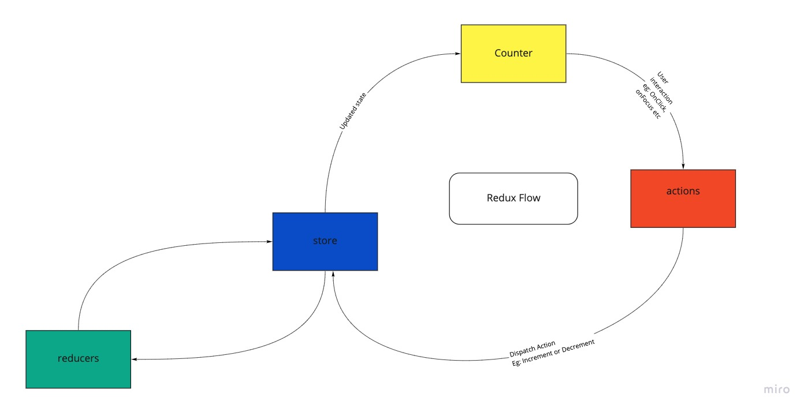

## Redux Architecture

In this document, we are understanding the redux architecture for the boiler plate code.

### createSlice

A function that accepts an initial state, an object full of reducer functions, and a "slice name", and automatically generates action creators and action types that correspond to the reducers and state.

The reducer argument is passed to createReducer().
