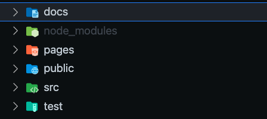
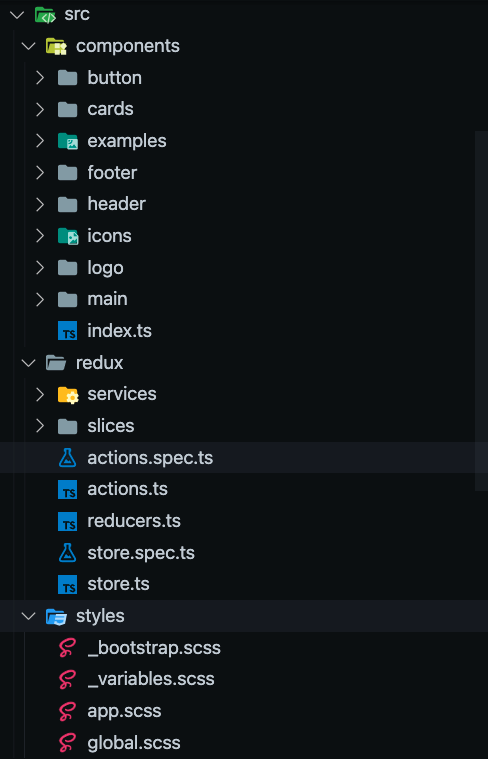

## Project folder structure

In this document, we are understanding the folder structure of the boiler plate code.

-   docs
    docs folder contains all the documentation related to the boiler plate.
-   pages
    This folder contains all the pages of next js it follows the Next.js standard. Ref: https://nextjs.org/docs/basic-features/pages
-   public
    public folder contains all the icons and translation files in locales folder
    
-   src
    src folder contains all the code that we would create for development like components, redux and scss files

    

-   test
    test folder contains configuration of the jest.
